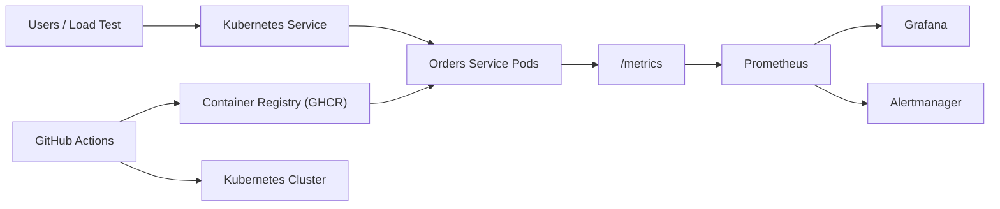

# Architecture

Core design choices:

- The application is intentionally stateless so it can scale horizontally with an HPA.
- Health, readiness, metrics, and structured logs are built into the service to support PRR discussions.
- Kubernetes manifests and Terraform both describe the same target state so you can demonstrate either direct manifest deployment or reproducible IaC provisioning.
- Local observability is provided by Docker Compose, while `observability/k8s` contains a `ServiceMonitor` for clusters that already use Prometheus Operator.
